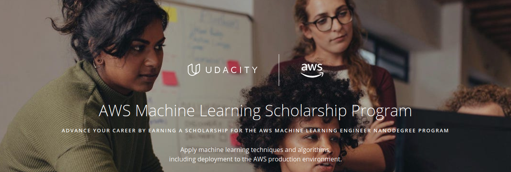

# AWS-Machine-Learning-Foundations-Scholarship
Destinado ao curso AWS Machine Learning Fundations da Udacity.

✨| Udacity AWS Machine Learning Foundations Nanodegree Program | Status
--- | ---| ---
1 | Welcome to the AWS Machine Learning Foundations Course | &#9744;
2 | Introduction to Machine Learning |  &#9744;
3 | Machine Learning with AWS |  &#9744;
4 | Software Engineering Practices, part 1 |  &#9744;
5 | Software Engineering Practices, part 2 |  &#9744;
6 | Object-Oriented Programming |  &#9744;
7 | AWS ML Foundations Assessment | &#9744;

## Status Definitions
 &#9744; Means that the particular Chapter is not started yet 👍  
 &#9746; Means that the particular Chapter is under progress 👨‍💻  
 &#9745; Means that the particular Chapter is completed 🎉
 

 
